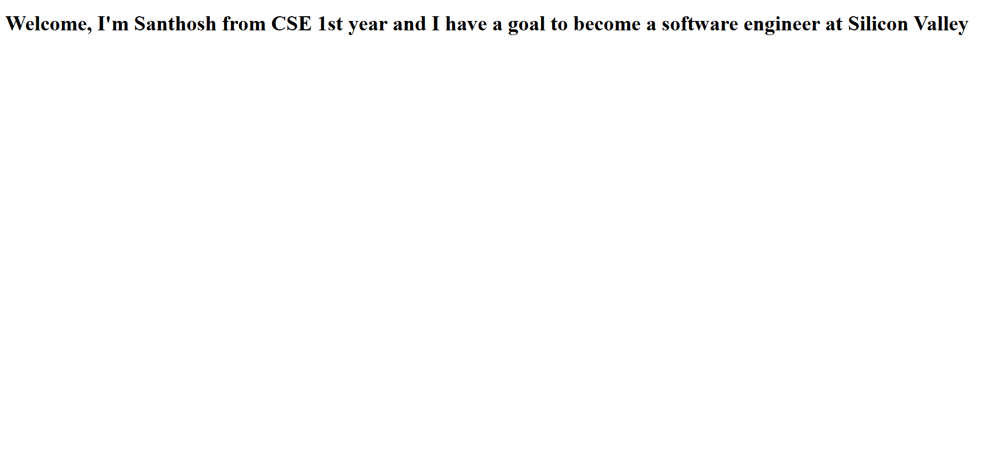

# EX01 Developing a Simple Webserver

# Date: 24/09/2025

# AIM:

To develop a simple webserver to serve html pages and display the configuration details of laptop.

# DESIGN STEPS:

## Step 1:

HTML content creation.

## Step 2:

Design of webserver workflow.

## Step 3:

Implementation using Python code.

## Step 4:

Serving the HTML pages.

## Step 5:

Testing the webserver.

# PROGRAM:

# OUTPUT:

# RESULT:

The program for implementing simple webserver is executed successfully.
